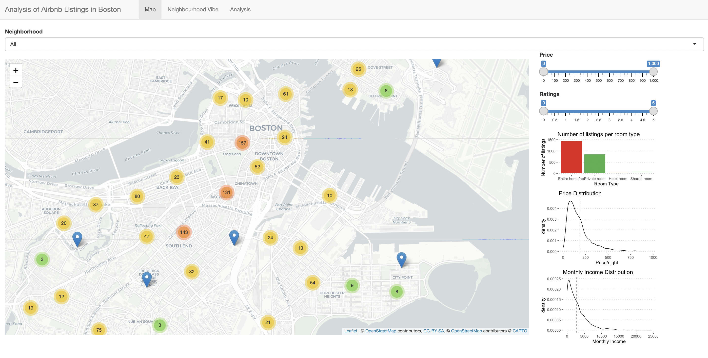

# 
Data Analysis Of Boston Airbnb Listings Using R

In our project, we have included Airbnb listings centered around Boston. Our analysis revolves around how we can effectively consider a booking based on different factors in Boston.  
These factors mainly include the neighborhood, available facilities, and price distribution on various room types. It helped get desired results on preferences, basically by observing their occupancy rates.  

# Overview

The Dataset is collected from <a href = "http://insideairbnb.com/get-the-data.html">Inside Airbnb</a>. The "listings.csv" file consists of details of all the airbnb listings in Boston including their price, ratings, name, host id, neighbourhood overview and many other columns describing details of listings with Number of listings: 3,213  

The data defination can be found in this link - <a href = "https://docs.google.com/spreadsheets/d/1iWCNJcSutYqpULSQHlNyGInUvHg2BoUGoNRIGa6Szc4/edit#gid=982310896"> Link </a>

In this analysis, we observed,
1. How the vibe varies with neighborhood
2. How price of each listing vary by their room type and neighborhood
3. Which area in Boston has the significant number and least number of listings?

# Methods
- Implemented leaflet map in R Shiny to show all the airbnb listings.
- Used Cluster marker to find the density of airbnb listings in the map.
- Plotted Price and Monthly Income Distribution of airbnb listings.
- Leveraged Bar Plots to find the number of listings per room type in the selected Neighborhood.
-  Used wordcloud2 library to find the word frequencies and plot a wordcloud to analyze the vibe of the selected neighbourhood.

# Analysis
1. Leaflet Map for each Airbnb Listings in Boston

2. Neighborhood Vibe for each listings

3. Avg price per day for each Room type

4. Number of Listings in each Neighborhood

5. Price Distribution for each Room Type

# Conclusion
- We can find the neighbourhood vibe based on the word cloud generator.
- Average price of listing is more for hotel rooms.
- No. of listings are more in Dorchester and less in West Roxbury.
- As we move away from the city, we can observe a decline in number of listings.
- There are more Entire room/apartment in the listings in all of Boston neighbourhoods and less shared rooms among room types.
 
